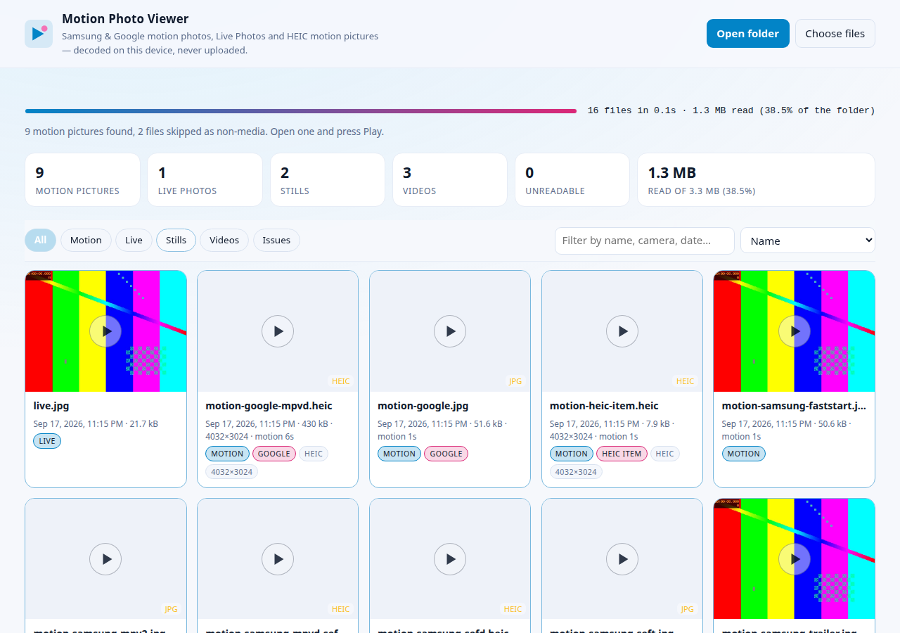

# Motion Photo Viewer

Open a folder. See every motion picture in it — Samsung and Google motion
photos, HEIC motion items, iPhone Live Photo pairs, plain videos — and play the
embedded clip. Everything happens on your device.

**Live:** <https://appunni-m.github.io/motion-photo-viewer/>



## The point

A motion photo is a still image with a short video hidden inside it. The camera
appends the video to the picture, or stores it in a box next to it inside a HEIC
file. Nothing on a normal desktop opens that video, and every online "motion
photo extractor" wants you to upload your pictures first.

This one does not. There is no server, no upload, no cache and no thumbnail
store:

* **All parsing is WebAssembly.** A ~80 kB dependency-free Rust module reads the
  JPEG segments, the EXIF, the XMP, the HEIF `meta` box, Samsung's SEFT trailer
  and the MP4 `moov`, and decides exactly where the video lives. It declares
  *zero* imports, so it cannot reach the network even in principle — the test
  suite asserts that.
* **No copies.** The extracted video is a `Blob` assembled from `File.slice()`
  ranges. For every real camera file checked so far that range is a single
  verbatim slice — the camera's own MP4, byte for byte. When a file needs
  rebuilding, only a few hundred bytes of headers are synthesized and the sample
  data is still copied by reference from the original file. Media bytes never
  enter WebAssembly memory, never get base64'd, and are never written anywhere.
* **Barely any CPU or disk.** Scanning reads a 64 kB header and a 64 kB trailer
  per file, plus at most one 192 kB window when the video header is needed.
  A real 8 MB Galaxy S8 motion photo is fully resolved by reading **4.1%** of it.
  Thumbnails are decoded only for tiles that are actually on screen, two at a
  time, and the video is only assembled when you press play.

## What it recognises

| Shape | How it is found | Result |
| --- | --- | --- |
| **Samsung JPEG** (Galaxy) | the SEFT trailer at the end of the file: a `MotionPhoto_Data` block states the video's exact byte length | byte-exact slice |
| **Samsung HEIC**, 2020 | a top-level `sefd` box carrying the SEFT trailer with the MP4 inline | byte-exact slice |
| **Samsung HEIC**, S22 and later | a top-level `mpvd` box holding `[MP4][sefd]`, whose trailer block is a 12-byte `mpv2` offset/size record | byte-exact slice |
| **Google / Motion Photo 1.0 JPEG** | XMP `Camera:MotionPhoto` + `Container:Directory` item lengths | byte-exact slice |
| **Google / Motion Photo 1.0 HEIC, AVIF** | the top-level `mpvd` box that the spec requires the file to end with | byte-exact slice |
| **Old Pixels** | `GCamera:MicroVideoOffset` = length of the trailing video | byte-exact slice |
| **HEIF video item** (the pre-2024 reading of the spec) | `meta` → `iinf`/`iloc` extents and a `cdsc` reference from the primary image | exact range, rebuilt only if it is not a standalone MP4 |
| Any ISOBMFF still with an appended MP4 | a second `ftyp` whose box chain walks to the end of the file | byte-exact slice |
| Some Samsung/Xiaomi exports with no metadata at all | the sample table of a trailer `moov`, with chunk offsets patched | rebuilt MP4, samples byte-identical |
| **iPhone / Google Live Photo pairs** | two files with the same base name, one still + one video | paired in the UI, video streamed from the companion |
| Plain JPEG / PNG / WebP / GIF / TIFF / MP4 | container sniffing | listed as a still or a video, never mis-reported as motion |
| A plain HEIC or AVIF | nothing: its `hvc1`/`av01` items are *images*, and images are never promoted to video | a still, with no play affordance |

Whether the *still* is decodable is the browser's business: Safari draws HEIC,
Chrome and Firefox show a labelled placeholder and offer the embedded video
instead. Byte-level details, including every route and the JSON plan the core
returns, are in [`docs/FORMATS.md`](docs/FORMATS.md).

### About `EmbeddedVideoFile` and `-b`

The way people normally get a Samsung motion photo's video out is ExifTool:

```sh
exiftool -b -Samsung:EmbeddedVideoFile IMG_20240101_120000.jpg > motion.mp4
```

`EmbeddedVideoFile` is ExifTool's *tag name*: the string never appears in a
Samsung file. What does appear is the SEFT trailer block named
`MotionPhoto_Data`, whose payload is either the MP4 itself or a 12-byte `mpv2`
record naming its offset and size, and that is what ExifTool exposes under that
tag. This viewer does the same job without ExifTool, without a shell and without
writing a file first: it reports the exact offset and length in the inspector
and streams those bytes into a player. `MotionPhoto_Data` is shown as a marker
when it is found.

Camera apps also name files in ways worth knowing: the spec's own convention is
`…MP.jpg` (with `MVIMG_*.jpg` from older Google Camera and `PXL_*.MP.jpg` from
newer), none of which affects detection — the bytes decide.

## Using it

1. Open the page and press **Open folder** (or drop a folder onto it).
2. Wait for the progress line — a few hundred files take well under a second,
   because only headers and trailers are read.
3. Filter to **Motion** or **Live**, then click any tile.
4. **Play motion** streams the embedded clip. **Save extracted video** writes it
   out only if you ask; nothing is written before that.

<kbd>←</kbd> and <kbd>→</kbd> move between files, <kbd>Space</kbd> plays or
pauses, <kbd>Esc</kbd> closes. The inspector shows the detection route, the
confidence, the exact byte range of the video, and a full report you can copy.

## Verified against real camera files

Detection was written from the published layouts, then checked against genuine
Samsung files from the public test data of
[`g0ddest/sm_motion_photo`](https://github.com/g0ddest/sm_motion_photo). The
expected byte ranges were recovered independently, by hand and with ExifTool and
ffprobe, before this parser was pointed at them:

| File | Device | Video range | Result |
| --- | --- | --- | --- |
| `photo.jpg` | Galaxy S8 (SM-G950U) | 4,647,675 B at offset 3,366,251 | exact, H.264 1440×1080, byte-exact slice |
| `photo.heic` | Samsung 2020 | 3,005,799 B | exact, HEVC 1440×1080, byte-exact slice |
| `photo-sg22-ultra.heic` | Galaxy S22 Ultra | 2,341,602 B | exact, HEVC 1440×1080, byte-exact slice |

All three are found through the SEFT trailer, resolved by reading 4–12% of the
file, and the extraction is a single verbatim slice that ffprobe reads back with
the same codec, width and height as the original range. Reproduce it with:

```sh
make check-real     # downloads the samples into a temp dir, ~17 MB
```

Your own files work too. `--local` checks one, and with `--expect` it asserts the
video's exact byte range (ExifTool reports the length; `exiftool -b
-EmbeddedVideoFile file.jpg > v.mp4` plus a byte search gives the offset):

```sh
node scripts/check-real-samples.mjs --local IMG_0001.jpg --expect 3366251:4647675
```

A Galaxy M34 5G capture (7,061,733 B; 4,270,333 B of HEVC video at offset
2,791,277) verifies exactly this way: `seft-trailer`, `hvc1.1.6.L120`, byte-exact
extraction, ffprobe agreeing on `hevc 1088x1088`.

That check needs the network, so it is deliberately not part of `make verify`.

## Working on it

Requires Node 20+, a Rust toolchain (pinned by `rust-toolchain.toml`) with the
`wasm32-unknown-unknown` target, and optionally `ffmpeg`, `wasm-opt` and Chrome
for the deeper checks.

```sh
make install        # npm ci
make wasm           # cargo build --release --target wasm32-unknown-unknown
make verify         # fmt + clippy + cargo test + the deterministic fixture suite
make fixtures       # real H.264 media via ffmpeg, for byte-exact checks
make verify-browser # headless Chrome against the assembled site
make check-real     # the real Samsung samples above (network)
make serve          # http://127.0.0.1:8000
```

`make verify` needs no browser and no network. It drives the real WebAssembly
module from Node against fixtures whose bytes are known, and asserts that the
extracted video equals the original MP4 **byte for byte** where the file allows a
direct slice, and that the sample bytes survive a rebuild where it does not. It
also checks the properties that are easy to regress: the module imports nothing,
no app file references an external origin, no storage API is used, and the
worker never reads a file in full.

The generated WASM is committed so the site can be served straight from a clone.
The release build recompiles it from source and ships that module, so the
committed copy is a convenience rather than a source of truth.

## How the pipeline works

`.github/workflows/pages.yml` mirrors the shape of
[tiny-image-star](https://github.com/appunni-m/tiny-image-star):

1. **wasm** — installs the pinned toolchain, runs `cargo fmt --check`, clippy
   with warnings denied and the unit tests, builds the module with `wasm-opt -Oz`,
   and uploads it as an artifact.
2. **verify** (Node 20 and 24) — installs ffmpeg, generates real media fixtures,
   downloads the freshly built module and runs `make verify`.
3. **build** — assembles `_site`, validates the artifact (self-contained, no
   absolute paths, correct ABI, size budget) and runs the browser smoke test,
   which fails if any request leaves the origin.
4. **deploy** — publishes to GitHub Pages.

The first run tries to enable Pages on the repository for you. If the token
cannot, set **Settings → Pages → Source** to **GitHub Actions** once and re-run
the workflow; every run after that deploys on its own.

## Limits, honestly

* **A video whose `moov` sits in the middle of a large file, with no trailer and
  no metadata, is not found by the default scan.** The header and trailer windows
  cannot see it. The inspector offers **Deep scan this file**, which reads more of
  that one file; the default scan never does.
* **Fragmented MP4 (`moof`) is not rebuilt.** It is detected and reported rather
  than guessed at.
* **HEVC playback depends on the browser.** Chrome and Edge decode HEVC only
  where the platform does; Safari always can. When the codec is unsupported the
  viewer says so instead of showing a black rectangle. Every Samsung HEIC clip is
  HEVC.
* **Live Photo pairing is by file name**, which is how Apple, Google Takeout and
  Samsung exports store them. The QuickTime `content.identifier` UUID is not read
  yet.
* **Multi-extent HEIF video items** (a video split across several `iloc` extents)
  are detected but not stitched.
* HEIC *still* decoding is the browser's: Chrome and Firefox cannot draw a HEIC
  today, so those tiles show a labelled placeholder.

## License

MIT — see [LICENSE](LICENSE). No third-party JavaScript, no fonts, no CDN: the
only dependencies are the Rust standard library and the browser.
